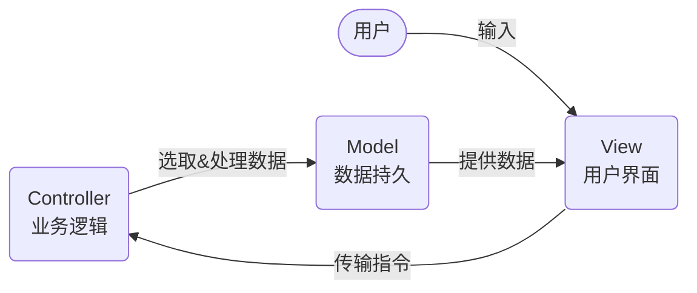

# JavaScript

## Variable Declaration

| Properties   | `var `             | `const ` | `let`              | `default`          |
| ------------ | ------------------ | -------- | ------------------ | ------------------ |
| Scope        | Function           | Block    | Block              | Global             |
| Updatable    | :heavy_check_mark: | :x:      | :heavy_check_mark: | :heavy_check_mark: |
| Redeclarable | :heavy_check_mark: | :x:      | :x:                | :heavy_check_mark: |
| Hoisted      | :heavy_check_mark: | :x:      | :heavy_check_mark: | :x:                |
| Initialized  | `undefined`​       | :x:      | :x:                | :x:                |

## Data Types

### Primitive types

1. `number`
2. `string`
3. `bigInt`
4. `boolean`
5. `undefined`
6. `symbol`

### Structural Types

1. `null`
2. `object`
3. `function`

## Loops / control structures

### `for ... in` loop:

Property **names** of an enumerable object

- array indices

- object property names

```js
const arr = ['a', 'b', 'c']
arr.prop = 'some prop'
for (let i in arr) {
  console.log(i)
}
// 0 1 2 prop
```

### `for ... of` loop:

Property **values** generated by an object-specific iterator

- array entries
- object property values

```js
const arr = ['a', 'b', 'c']
arr.prop = 'some prop'
for (let i of arr) {
  console.log(i)
}
// a b c
```

## Higher-order Functions

### ForEach

Executes `callback` once for each array element **w/o** mutation

```js
arr.forEach(callback(currentValue[, index[, array]]) {
// execute something
}[, this]);
```

### Map

Return a new array with `callback` executed once on each element

```js
let newArray = arr.map(callback(currentValue[, index[, array]]) {
// return element for newArray, after executing something
}[, this]);
```

### Filter

Return a new array with elements conditionally filtered

```js
let newArray = arr.filter(callback(currentValue[, index[, array]]) {
// return element for newArray, if true
}[, this]);
```

`callback` - Test each element of the array. Return `true` to keep the element, `false` otherwise.

- `currentValue` - The current element being processed in the array
- `index (optional)` - The index of the current element being processed in the array
- `array (optional)` - The array filter was called upon

### Reduce

Executes a **reducer** function on each element ⇒ returns the accumulator after all executions

```js
arr.reduce(callback(accumulator, currentValue, [, index[, array]] )[, initialValue])
```

`callback`- Execute on each element of the array except the 1st

- `accumulator`- accumulates callback's return values; initialized to the 1st element
- `currentValue` - The current element being processed in the array

`initialValue (optional)` - A value to use as the 1st argument to the initial call of `callback`

## Object-Oriented Programming

### Reference of `this`

| Where             | Code Example                                  | What `this` refers to                 |
| ----------------- | --------------------------------------------- | ------------------------------------- |
| Regular Function  | `function f() { console.log(this) }`          | the global object                     |
| Method            | `{a: 1, f: function() { console.log(this) }}` | the object `f` is called on           |
| Arrow Function    | `() => { console.log(this) }`                 | `this` when the function is declared  |
| Called with `new` | `new f() { console.log(this) }`               | empty object returned by constructor  |
| `call/bind/apply` | `obj.f.call(this)`                            | the 1st argument of `call/bind/apply` |

### Object Accessor

```js
var person = {
language : "",
set lang(lang) { this.language = lang }
get lang() { return this.language }
	getLang: function() { return this.language }
};
person.lang = "en"; // invokes the setter -> set property
console.log(person.lang); // invokes the getter -> property
console.log(person.getLang()); // called as a function
```

#### Why Using Getters and Setters?

- Simpler syntax
- Equal syntax for properties and methods
- Secure better data quality
- Doing things behind-the-scenes

#### `Object.defineProperty()`

Creates custom getter & setters

```js
var obj = { counter: 0 }
Object.defineProperty(obj, 'increment', {
  get: function () {
    this.counter++
  },
})
Object.defineProperty(obj, 'subtract', {
  set: function (value) {
    this.counter -= value
  },
})
obj.increment // obj.counter == 1
obj.subtract = 2 // obj.counter == -1
```

### Object Constructor

```js
function Person(first, last, age, eyecolor) {
  this.firstName = first
  this.lastName = last
  this.age = age
  this.eyeColor = eyecolor
}
var myFather = new Person('John', 'Doe', 50, 'blue')
var myMother = new Person('Sally', 'Rally', 48, 'green')
```

**Cannot** add new properties to an existing object constructor

```js
Person.nationality = 'English'
```

- Does not affect instantiated objects

### `new` Operator

```js
const foo = new Foo()
```

| Step                                                         | Implementation                                       |
| ------------------------------------------------------------ | ---------------------------------------------------- |
| 1. Create a blank JS object                                  | `const foo= { }` or <br />`const foo = new Object()` |
| 2. Add property `__proto__`                                  | `foo.__proto__ = Foo.prototype`                      |
| 3. Bind as `this` context & add properties                   | `const ret = Foo.apply(foo, arguments)`              |
| 4. Return `this` if the constructor doesn’t return an object | `return typeof ret === 'object' ? ret : foo;`        |

#### `Object.create()` vs `new`

```js
const foo = Object.create(Foo.prototype)
```

Does not run the constructor function vs `new`

### Object Prototype

| Property    | Where it Exists     | What is It                         |
| ----------- | ------------------- | ---------------------------------- |
| `__proto__` | Instantiated Object | 指向构造函数的 `prototype`         |
| `prototype` | Object Constructor  | Internal `[Prototype]`of an object |

```js
foo.__proto__ === Foo.prototype
foo.prototype === undefined // does not exist on an instantance
```

- Properties defined on an object’s prototype do not exist on the object itself
- Modifying an object’s prototype affect all of its instances;

#### Prototype Chain

```js
foo.__proto__.__proto__ === Object.prototype // chaining
foo instanceof Foo
foo instanceof Object
Object.prototype.__proto__ === null // end of the chain
```

#### ES5 Syntax

```js
Object.getPrototypeOf(obj)
Object.setPrototypeOf(obj, prototype)
```

#### Functions defined on the prototype

- When called w/ a instance: `this` points to the instance
- When called on its own (on the prototype): `this` points to the global object

### Classes (ES6 Syntax)

```js
// Declaration
class Rectangle {
  constructor(height, width) {
    this.height = height
    this.width = width
  }
  get area() {
    // Getter
    return this.calcArea()
  }
  calcArea() {
    // Method
    return this.height * this.width
  }
  static displayName = 'rect' // static property
  static calcArea(height, width) {
    return height * width
  }
}

class Button extends Rectangle {
  constructor(height, width, func) {
    super(height, width)
    this.func = func
  }
  click() {
    this.func()
  }
}
```

### Closure / Scope in JS

Every scope in JS has live access to variables in the outer scope

- Inner functions have access to variables in the outer function even after the outer function terminated

Usage

- Create private scopes w/ true private variables

  - Variables in a closure can only be modified by functions in the same scope

- Access outer variable in a callback function

  ```js
  const getData = (url) => {
    return fetch(url).then(() => console.log(url))
  }
  ```

## Functions

### Decorators

```javascript
function decorator(func) {
  return function (...args) {
    doSomething(func(...args))
  }
}
```

### Hoisting

`var`

```javascript
function hoist() {}
```

`function`

```javascript

```

### Using Callback Functions

_The problem of losing context & its solutions:_

#### Methods on Functions

`bind`

`apply`

`call`

#### Arrow Functions

Chaining

```js
const func = f => x => f(x) + 1
// equivalent to
function func(f) {
return func2(x) {
return f(x) + 1
}
}
```

Where `this` keyword points to

Where not to use arrow functions

## Modules

File IO: `fs` module

## Async in JS

**单线程**：JS 的 V8 引擎中负责解释和执行 JavaScript 代码的线程只有**主线程**

**同步**：函数 A 返回时，调用者**<u>能够</u>**得到预期结果

**异步**：函数 A 返回时，调用者**<u>不能</u>**立即得到结果

### Using Callback Functions

```js
fs.readFile('foo.txt', 'utf8', function (err, data) {
  console.log(data)
})
```

- 返回后会通知`callback`进行接下来的操作
- 非阻塞：拿到结果前不会阻塞其他代码的运行
- 工作线程在异步操作完成后需要通知主线程

### 消息队列和事件循环

**消息队列**：消息队列是一个<u>先进先出</u>的队列，它里面存放着各种**消息**。

**事件循环**：事件循环是指主线程重复从消息队列中取消息、执行的过程。

- 一次循环 = 主线程从消息队列取一个消息并执行的过程


=> 异步过程的回调函数，一定不在当前这一轮事件循环中执行。

**DOM 事件**：触发通过`addEventListener()`添加的事件监听器

```js
button.addEventListener('click', callback)
```

用户点击按钮 –> 触发 click 事件 –> 将`callback`封装成消息放入队列 –> 主线程执行`callback`

### Promise

A solution to resolving sync & async requests / callback hell

```js
const calculate = (a, b) =>
  new Promise((resolve, reject) => {
    let sum = a + b
    if (isNaN(sum)) {
      reject('failed')
    } else {
      resolve('success')
    }
  })
calculate
  .then((number) => {
    console.log('Then', number)
  })
  .catch((number) => {
    console.log('Catched', number)
  })
```

#### `Promise.all([promise1, promise2])`

Run all promises in parallel; move to `.then` when **ALL** are resolved

#### `Promise.race([promise1, promise2])`

Run all promises in parallel; move to `.then` when **ANY** is resolved

#### A+规范

### `async/await` 语法糖

```js
async function logSum(a, b) {
  const sum = await calculate(a, b)
  console.log(sum)
}
```

## 消息范式：观察者/订阅-发布


# Front-End

## 浏览器事件

immutable.js

## 开发模式

### MVVM

`Model` (数据层)：数据和业务逻辑

`View` (视图层)：UI/数据的展示

`ViewModel` (监听层)：监听`Model`中数据的改变，更新`View`层 "Model of View"


### MVC



# HTML

## Elements

### Void elements

Does not have content

`area`, `base`, `br`, `col`, `embed`, `hr`, `img`, `input`, `link`, `meta`, `param`, `source`, `track`, `wbr`

### The `template` element

`template`

### Raw text elements

`script`, `style`

### Escapable raw text elements

`textarea`, `title`

### Foreign elements

Elements from the [MathML namespace](https://infra.spec.whatwg.org/#mathml-namespace) and the [SVG namespace](https://infra.spec.whatwg.org/#svg-namespace).

### Normal elements

All other allowed [HTML elements](https://html.spec.whatwg.org/multipage/infrastructure.html#html-elements) are normal elements.

## Form

```html
<form method="POST" action="/path">
  <input type="hidden" value="{crsf_token}" /> hidden from views <input type="text" value="" /> text
  input field <input type="submit" /> the submit button
</form>
```

# CSS

## Pseudo Elements

# Web

## URL


## TCP/IP

_A stack of protocols_

1. **Application Layer**: application level (HTTP, SMTP, etc.)
2. **Transport Layer**: communication between applications (**TCP**, UDP)
3. **Network Layer**: routing packets of data across network boundaries (**IP**)
4. **Physical / Link Layer**: convert data to network signal & v.v.


### TCP vs UDP

| TCP 传输控制协议                                       | UDP 用户数据报协议             |
| ------------------------------------------------------ | ------------------------------ |
| Transmission control protocol                          | User data protocol             |
| Guarantee data delivered is contact & in correct order | Do not guarantee data delivery |
| Slower                                                 | Faster                         |

### 连接建立阶段：三次握手

| 第一次 | C→S | C 应用进程主动打开，发出请求报文：                           | SYN=1,seq=x               |
| ------ | --- | ------------------------------------------------------------ | ------------------------- |
| 第二次 | S→C | S 应用进程被动打开，若同意请求，发回确认报文：               | SYN=1,ACK=1,ack=x+1,seq=y |
| 第三次 | C→S | C 收到确认报文后，通知上层应用进程连接已建立，发出确认报文： | ACK=1,ack=y+1             |

S 收到 C 的确认报文后，通知其上层应用进程连接已建立。

### 连接释放阶段：四次挥手

| 第一次 | C→S | C 应用进程发出连接释放报文段，停止发送数据                                    | FIN=1,seq=u               |
| ------ | --- | ----------------------------------------------------------------------------- | ------------------------- |
| 第二次 | S→C | S 确定收到释放报文，发出确认报文。 ⇒ 连接进入半关闭状态，C 不再发送数据。     | ack=u+1,seq=v             |
| 第三次 | S→C | S 若没有要发送的数据，应用进程通知服务器释放 TCP 连接。S 发出最后一个报文：   | FIN=1,ACK=1,seq=w,ack=u+1 |
| 第四次 | C→S | C 收到连接释放报文段之后，发出确认：经过 2MSL(最长报文端寿命)后，TCP 连接结束 | ACK=1,seq=u+1,ack=w+1     |

### Connection / Disconnection Diagram


### OIS Model


| OSI 七层网络模型        | TCP/IP 四层概念模型 | 对应网络协议                           |
| ----------------------- | ------------------- | -------------------------------------- |
| 应用层（Application）   | 应用层              | HTTP、TFTP, FTP, NFS, WAIS、SMTP       |
| 表示层（Presentation）  |                     | Telnet, Rlogin, SNMP, Gopher           |
| 会话层（Session）       |                     | SMTP, DNS                              |
| 传输层（Transport）     | 传输层              | TCP, UDP                               |
| 网络层（Network）       | 网络层              | IP, ICMP, ARP, RARP, AKP, UUCP         |
| 数据链路层（Data Link） | 数据链路层          | FDDI, Ethernet, Arpanet, PDN, SLIP,PPP |
| 物理层（Physical）      |                     | IEEE 802.1A, IEEE 802.2 到 IEEE 802.11 |

## HTTP

### Request


#### Methods

Idempotent 幂等：请求无副作用，发送同样的请求一定会收到同样的响应 (`幂等 -> 安全`)

| 方法      | 描述                     | **请求体**         | 响应体             | 幂等               | 安全               | 缓存               |
| :-------- | :----------------------- | ------------------ | ------------------ | ------------------ | ------------------ | ------------------ |
| **`GET`** | 获取指定资源             | :x:                | :heavy_check_mark: | :heavy_check_mark: | :heavy_check_mark: | :heavy_check_mark: |
| `HEAD`    | 同`GET` 但只获取响应头部 | :x:                | :x:                | :heavy_check_mark: | :heavy_check_mark: | :heavy_check_mark: |
| `POST`    | 提交数据                 | :heavy_check_mark: | :heavy_check_mark: | :x:                | :x:                | :heavy_check_mark: |
| `PUT`     | 替换指定资源             | :heavy_check_mark: | :x:                | :heavy_check_mark: | :x:                | :x:                |
| `DELETE`  | 删除指定资源             | :heavy_check_mark: | :heavy_check_mark: | :heavy_check_mark: | :x:                | :x:                |
| `CONNECT` | 将连接改为`tunnel`       | :x:                | :heavy_check_mark: | :x:                | :x:                | :x:                |
| `OPTIONS` | 描述通信选项（预检请求） | :x:                | :heavy_check_mark: | :heavy_check_mark: | :heavy_check_mark: | :x:                |
| `TRACE`   | 回显服务器收到的请求     | :x:                | :x:                | :heavy_check_mark: | :heavy_check_mark: | :x:                |
| `PATCH`   | 对已知资源进行局部更新   | :heavy_check_mark: | :heavy_check_mark: | :x:                | :x:                | :heavy_check_mark: |

#### Form

|                   | GET                | POST              |
| ----------------- | ------------------ | ----------------- |
| Payload Location  | URL query string   | HTTP request body |
| Repeat on refresh | :heavy_check_mark: | :x:               |
| Usage             | Filtering / search | Creating resource |

### Response


#### Status Code

| **状态码** | **状态码英文名称**    | **中文描述**                                                                                                                                                     |
| ---------- | --------------------- | ---------------------------------------------------------------------------------------------------------------------------------------------------------------- |
| 200        | OK                    | 请求成功。一般用于 GET 与 POST 请求                                                                                                                              |
| 201        | Created               | 已创建。成功请求并创建了新的资源                                                                                                                                 |
| 202        | Accepted              | 已接受。已经接受请求，但未处理完成                                                                                                                               |
| 301        | Moved Permanently     | 永久移动。请求的资源已被永久的移动到新 URI，返回信息会包括新的 URI，浏览器会自动定向到新 URI。今后任何新的请求都应使用新的 URI 代替                              |
| 302        | Found                 | 临时移动。与 301 类似。但资源只是临时被移动。客户端应继续使用原有 URI                                                                                            |
| 304        | Not Modified          | 未修改。所请求的资源未修改，服务器返回此状态码时，不会返回任何资源。客户端通常会缓存访问过的资源，通过提供一个头信息指出客户端希望只返回在指定日期之后修改的资源 |
| 307        | Temporary Redirect    | 临时重定向。与 302 类似。使用 GET 请求重定向                                                                                                                     |
| 400        | Bad Request           | 客户端请求的语法错误，服务器无法理解                                                                                                                             |
| 401        | Unauthorized          | 请求要求用户的身份认证                                                                                                                                           |
| 403        | Forbidden             | 服务器理解请求客户端的请求，但是拒绝执行此请求                                                                                                                   |
| 404        | Not Found             | 服务器无法根据客户端的请求找到资源（网页）。通过此代码，网站设计人员可设置"您所请求的资源无法找到"的个性页面                                                     |
| 405        | Method Not Allowed    | 客户端请求中的方法被禁止                                                                                                                                         |
| 408        | Request Time-out      | 服务器等待客户端发送的请求时间过长，超时                                                                                                                         |
| 409        | Conflict              | 服务器完成客户端的 PUT 请求时可能返回此代码，服务器处理请求时发生了冲突                                                                                          |
| 500        | Internal Server Error | 服务器内部错误，无法完成请求                                                                                                                                     |
| 501        | Not Implemented       | 服务器不支持请求的功能，无法完成请求                                                                                                                             |
| 502        | Bad Gateway           | 作为网关或者代理工作的服务器尝试执行请求时，从远程服务器接收到了一个无效的响应                                                                                   |

#### Headers

- Content-Type
- Set-Cookie
- Cookie
- Location

### Demo HTTP Server

```javascript
const net = require(`net`)
const server = net.createServer(handleConenct)
function handleConnect(data) {}
function handleData(sock, data) {}
server.listen(PORT)
```

## Storage

|                  | Cookie           | Session Storage | Local Storage |
| ---------------- | ---------------- | --------------- | ------------- |
| Capacity         | 4kb              | 5mb             | 10mb          |
| Where accessible | Any window       | Same tab        | Any window    |
| Expiration       | Manually set     | On tab close    | Never         |
| Location         | Browser & server | Browser only    | Browser only  |
| Sent w/ Request  | Yes              | No              | No            |

## Cookie

A small piece of data a server sends to the client browser

### Cookie Creation

`Set-Cookie` Response Header Instructs the browser to create a cookie

#### Content

- **Data**: name1=value pairs desperate by ;

- **Expiration**: how long the cookie is valid for

- | **Security options** | Description                                                                                                                      |
  | -------------------- | -------------------------------------------------------------------------------------------------------------------------------- |
  | Domain               | Cookies sent will only be valid for this domain (default is current domain)                                                      |
  | Path                 | Cookies sent will only be valid for this path (default is all paths)                                                             |
  | HttpOnly             | Only allow reading of cookies via http & disable JS<br /> _(3rd party JS is by default allowed to read cookies for that domain)_ |
  | Secure               | Cookies will only be sent if the request is encrypted (using TLS/SSL)                                                            |

  **HttpOnly & Secure** are necessary in almost all cases

#### Properties

- Multiple `Set-Cookie` is allowed in one response
- Only **data** will be sent back to the server in a http request
- A server cannot force the browser to delete cookies; expiration is only expected to work

### Cookie Types

#### Session Cookies

Deleted when the client is shut down

#### Permanent Cookies

Only expires at certain date / after a period of time

##### Expires(date)

`Set-Cookie: foo=bar; Expires=Thu, 29 Oct 2016 07:28:00 GMT;`

##### Max-Age

`Set-Cookie: foo=bar; Max-Age=300;`

## Session

### Usage

#### Maintain "state" between requests

- Authentication

- Store persistent data

- - Visits, user preference, tracking, etc.

#### Store data on the server about a user

- Use session ID to identify / represent the user

#### Link the data to the requests from a particular client

- Session ID retransmitted on every request from the same client

### Session ID

The identifier used to represent a session owned by a client

#### Security Issue: Owning session ID = Owning the session

⇒ secure generation (non-sequential)

⇒ shouldn’t be present in query string

⇒ adequately long / complex

### Session Creation & Use

1. Server generates session id for an http request
2. Server sets client's cookie with the session ID in the http response
3. Client creates / updates a cookie tied to the domain
4. Client sends the cookie w/ every request
5. Server finds the session according to the ID received

### Session Store

Location where the server stores the sessions data

Location: in-memory / file-based / database

## Cache

## Cross-origin

### Same Origin Policy 同源策略

_浏览器端的安全机制_

同源：协议、域、端口相同

- **DOM 同源策略**：禁止对不同源页面进行 DOM 操作
- **XMLHttpRequest 同源策略**：拦截向不同源服务器地址的请求的**回应**

防范的攻击

- 访问 iframe 内容
- CRSF

允许的跨域资源访问

- JavaScript: `<script>` 标签
- CSS: `<link rel="stylesheet" href="styles.css">`
- 图片：` `

### 1. JSONP: 跨域 GET 请求

用 JS 包装的数据

- HTML 中的`<script scr="">, , <link rel="a.css">`标签可以发送跨域请求

请求：query string 包括 callback function 的名字

```html
<script>
  function jsonpCallback(response) {
    console.log('jsonp response', response)
  }
</script>
<script type="text/javascript" src="/api?callback=jsonpCallback"></script>
```

响应：包裹着数据的 callback function

```js
jsonpCallback(JSON.stringify(data))
```

收到后会被`<script>`标签立即执行

### 2. 空`iframe`加`form`: 跨域 POST 请求

1. 创建一个 POST form，`target`设置为‘some-target’

2. 创建一个`name`和`form`的`target`一致的`iframe`，`src`可以留空

   ```html
   <form id="form1" action="" target="target1" method="post"></form>
   <iframe id="xxx" name="target1" src=""></iframe>
   ```

3. 通过 JS 来 submit 这个 form

   ```js
   $('#form1').attr('action', 'url')
   $('#form1').submit()
   ```

### 3. Cross-Origin Resource Sharing 跨域资源共享 (CORS)

#### 简单请求

请求方法为：`HEAD, GET, POST`

请求头仅包含：

- `Accept`
- `Accept-Language`
- `Content-Language`
- `Last-Event-ID`
- `Content-Type`：只限于 `application/x-www-form-urlencoded、multipart/form-data、text/plain`

##### 流程

1. Client 发送请求
2. Server 判断请求源是否安全
   - 安全：发送响应头包含`Access-Control-Allow-Origin: origin-of-request`的响应
   - 不安全：发送普通的响应
3. Client 浏览器会拦截没有`Access-Control-Allow-Origin`的响应


#### 非简单请求

必须首先使用 [`OPTIONS`](https://developer.mozilla.org/zh-CN/docs/Web/HTTP/Methods/OPTIONS)方法发起一个预检请求到服务器，以获知服务器是否允许该实际请求。

##### 流程

1. Client 发送`OPTIONS`预检请求

   ```http
   OPTIONS /resources/post-here/ HTTP/1.1
   ...
   Origin: http://foo.example
   Access-Control-Request-Method: POST (实际请求的方法)
   Access-Control-Request-Headers: X-PINGOTHER, Content-Type (自定义的请求头)
   ```

2. Server 回复预检请求

   ```http
   HTTP/1.1 200 OK
   ...
   Access-Control-Allow-Origin: http://foo.example
   Access-Control-Allow-Methods: POST, GET, OPTIONS
   Access-Control-Allow-Headers: X-PINGOTHER, Content-Type
   Access-Control-Max-Age: 86400 (表明该响应的有效时间为86400秒 / 24小时)
   ```

3. Client 发送实际请求：包含自定义的请求头和 payload

4. Server 响应实际请求

   ```http
   HTTP/1.1 200 OK
   ...
   Access-Control-Allow-Origin: http://foo.example

   [payload]
   ```


#### 附带身份凭证的请求


### 4. 代理

# Express

:heavy_check_mark: ​Routing

:heavy_check_mark: Templating

:heavy_check_mark: Request/ Response objects

:x: Authentication

:x: Database / object-relational mapper

:x: Dictate project layout

## Routing

Express Routing - [Route Parameters](https://expressjs.com/en/guide/routing.html)

```js
app.all('/') // handle all request methods
```

### Path Matching

| Path String | Matches                                 |
| ----------- | --------------------------------------- |
| '/ab?cd'    | `/acd` and `/abcd`                      |
| '/ab+cd'    | `/abcd`, `/abbcd`, `/abbbcd`, and so on |
| '/ab\*cd'   | anything between `/ab` `cd`             |
| '/ab(cd)?e' | `/abe` and `/abcde`                     |
| /a/         | anything with`a` in it (regex)          |

### Route Parameters

```javascript
app.get('/users/:userId/books/:bookId', function (req, res) {
  res.send(req.params)
})
```

## Middlewares

### Serving Static files

```javascript
function serveStatic(req, res, next) {
  fs.readFile(`public/${req.path}`, (err, data) => {
    if (err) {
      next()
    } else {
      res.send(data)
    }
  })
}
```

### Body Parsers

Populate `req.body` with `name:value` pairs parsed from the request body

```js
express.json([options])
```

- parses incoming requests with JSON payloads

```js
express.urlencoded({ extended: false })
```

- parses incoming requests with `urlencoded` payloads
  - Original Body: `field1=value1&field2=value2`
  - Parsed Body:`req.body = { field1: value1, field2: value2 `

### Session middleware

```js
const session = require(`express-session`)
app.use(
  session({
    secret: `string`, // encrypt the session ids -> long & complex
    saveUninitialized: false, // don't save new empty session
    resave: false, // not to resave unmodified session data
  })
)
```

Creates a `req.session` object that persists between requests

## Form handling

### GET form

```js
app.get(`/form`, (req, res) => {
  console.log(req.query)
})
```

### POST form

```js
app.use(express.urlencoded({ extended: false })) // body parser middleware to decode
app.post(`/form`, (req, res) => {
  req.body
})
```

## Request Object

`req.query`

`req.header`

`req.ip`

`req.path`

`req.method`

`req.cookie`

`req.params`: object w/ keys-value pairs of what's after `:` in the path

```javascript
app.get(`/foo/:bar`, (req, res) => {
  console.log(req.params.bar)
})
```

## Response Object

`res.send()`

`res.status(<status code>).send(<data>)`

`res.set(<header>)`

## Handlebars (`hbs`) templating

| public | static files                                                                                                                                                                          |
| ------ | ------------------------------------------------------------------------------------------------------------------------------------------------------------------------------------- |
| src    | app.js                                                                                                                                                                                |
| views  | .hbs template files ~ html webpages layout.hbs - the default html rendered by every call on res.render() - 1st parameter of res.render() = location of the hbs file layout.hbs's body |

### Loop

```html
<ul>
  {{#each people}}
  <li>{{this}}</li>
  {{/each}}
</ul>
```

### Condition

```html
<div>
  {{#if author}}
  <h1>{{firstName}} {{lastName}}</h1>
  {{/if}} {{#unless license}}
  <h1>WARNING: No license!</h1>
  {{/unless}}
</div>
```

### Files Structure

`/views/`
`layout.hbs` - default template to render
`somethingElse.hbs` - can be used in `render()` to fill the body of `layout.hbs`

## REST API

| 目的                              | 请求方法  | Route 格式   |
| --------------------------------- | --------- | ------------ |
| **增** Create a new entry         | POST      | `/tasks`     |
| **删** Delete an existing entry   | DELETE    | `/tasks/:id` |
| **查** Query all existing entries | GET       | `/tasks/`    |
| **查** Query one specific entry   | GET       | `/tasks/:id` |
| **改** Modify an existing entry   | PUT/PATCH | /tasks/:id   |

## koa.js

Onion-style middleware

- Pre-processing
- Post-processing

# Database

## Types of Database

### Relational

Organize data in tables

- Rows & columns

- Can have customizable & complicated constraints

- - A bit rigid

- Tables can link / refer to each other

### Non-relational

- Constraints are not implemented by default
- Doesn't model data using tables & relations
- Document-Object Mapper

## MongoDB

**Non-relational database**

**Lightweight & suitable for client-side-heavy web apps**

- A lot more flexible

### Properties

Do not need to create / initialize before using

No constraints on properties

- Logic for constraints, data integrity rules should go in application layer

### Structure

- `DBMS -> DB -> Collection -> Document -> key:value pairs`

- Relational vs nonrelational DB

### Use

```js
db.cats.insert({ name: 'karen', lives: 999 })
db.cats.find({ lives: 5 })
```

## Mongoose

Node module to use MongoDB in NodeJS applications

**Object-document mapper**: Map MongoDB documents to JS objects

### Schema

Rules / template for documents

Specifies what key-value Paris are stored & constraints

###

| Field Constraints | Description                                |
| ----------------- | ------------------------------------------ |
| Type              | Boolean/String/Number/etc.                 |
| max               |                                            |
| min               |                                            |
| required          | Returns error if this field is not present |
| default           | `true/false`: default value                |

### Use

```js
const mongoose = require('mongoose')
const URLSlugs = require('mongoose-url-slugs')
mongoose.model('Pizza', Pizza)
mongoose.model('Topping', Topping)
mongoose.connect('mongodb://localhost/pizzadb')
```

- Model
- Embedded docs
- Connect
- Find
- Write
- [Mongoose - Validation](https://mongoosejs.com/docs/validation.html)

# Misc

- Node, NPM, Git
- Export & import modules
- [Router Objects](https://cs.nyu.edu/courses/spring21/CSCI-UA.0480-034/_site/slides/14/routers.html)
- [URL Parameters](https://cs.nyu.edu/courses/spring21/CSCI-UA.0480-034/_site/slides/14/params.html)
- [Validation](https://cs.nyu.edu/courses/spring21/CSCI-UA.0480-034/_site/slides/15/validation.html)

## _Excluded Topics_

- Scaffolding
- Route objects
- Passport lib
