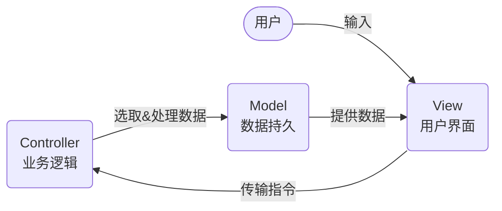

## Mermaid



<!-- ## Image

### Relative Path


### Web URL


### Absolute Path

 -->

<!-- ## Prism / Highlighting

```js
export function formatSlug(slug) {
  return slug.replace(/\.(mdx|md)/, '')
}
``` -->
